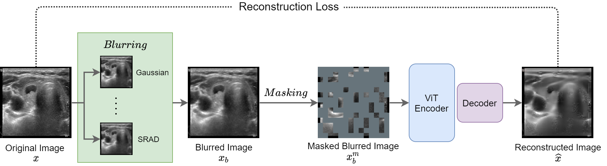

### Deblurring Masked Image Modelling is Better Recipe for Ultrasound Image Analysis

### Introduction
Our initial paper is presented in [Deblurring Masked Autoencoder is Better Recipe for Ultrasound Image Recognition](https://arxiv.org/pdf/2306.08249.pdf) which has been accepted in MICCAI 2023.

Compared with the initial version which propose a novel deblurring MAE for ultrasound image recognition, this repository is an extension which has the following enhancements:
- We extended the deblurring idea from only MAE to two MIM-based approaches ([MAE](https://openaccess.thecvf.com/content/CVPR2022/papers/He_Masked_Autoencoders_Are_Scalable_Vision_Learners_CVPR_2022_paper.pdf) and [ConvMAE](https://arxiv.org/pdf/2205.03892.pdf) ).
- We increased the number of thyroid ultrasound images for pretraining from 10,675 to 280,000.
- We extended the downstram task from only classification to classification and segmentation.

*The corresponding extended paper is still working in progress, we will release it soon.*


### Method


### Pre-trained checkpoints
The pre-trained models including our proposed deblurring (Deblurring MAE and Deblurring ConvMAE), as well as the vanilla MAE and ConvMAE. All models are pretrained with 280,000 thyroid ultrasound images.
The following table provides the pre-trained checkpoints:

<table><tbody>
<!-- START TABLE -->
<!-- TABLE HEADER -->
<th valign="bottom"></th>
<th valign="bottom">MAE(Base)</th>
<th valign="bottom">ConvMAE(Base)</th>

<!-- TABLE BODY -->
<tr><td align="left">Vanilla</td>
<td align="center"><a href="https://drive.google.com/file/d/1bXcf6A0kQccnpe3Tk2l0-xWl5HSe4fJ2/view?usp=drive_link">download</a></td>
<td align="center"><a href="https://drive.google.com/file/d/1Tv9yjWM9sqxmd60GEIT3WwnT3CHt0kjg/view?usp=drive_link">download</a></td>
</tr>
<tr><td align="left">Deblurring</td>
<td align="center"><a href="https://drive.google.com/file/d/1cOmi7OaqPSMrds7gVZfzTrv8ftEWIH_u/view?usp=drive_link">download</a></td>
<td align="center"><a href="https://drive.google.com/file/d/19PdQpkOOEAi-4aJvVnwB2JTyP-KKa5pp/view?usp=drive_link">download</a></td>
</tr>
</tbody></table>

### Fine-tuning Results
We provide the fine-tuning segmentation results on publicly available [TN3K dataset](https://drive.google.com/file/d/1reHyY5eTZ5uePXMVMzFOq5j3eFOSp50F/view?usp=sharing):

<table><tbody>
<!-- START TABLE -->
<!-- TABLE HEADER -->
<th valign="bottom">Method</th>
<th valign="bottom">Segmentation Model</th>
<th valign="bottom">Pretraining</th>
<th valign="bottom">IoU (%)</th>
<tr>
<td>-</td>
<td><a href="https://www.sciencedirect.com/science/article/pii/S0010482522010976?casa_token=_EBAHS8oNlEAAAAA:WmsXBHQAPKT9-ou7Exth9mw3vJvH5HfVe6PP0UC4V5l-5QF_gU37qEsBOKj73wap1F2v3PL5uQ">TRFE+</a></td>
<td>-</td>
<td>74.47</td>
</tr>
<tr>
<td>ConvMAE</td>
<td>U-Net++(ConViT-B)</td>
<td>US-Esaote-280K</td>
<td>74.40</td>
</tr>
<tr>
<td><a href="https://drive.google.com/file/d/1iN9lNFOiYD_Nu8GsmRTle4wq5-lZ6ycq/view?usp=drive_link">Deblurring ConvMAE</td>
<td>U-Net++(ConViT-B)</td>
<td>US-Esaote-280K</td>
<td>74.96</td>
</tr>
</tbody></table>


### installation
- Clone this repo:

```bash
git clone https://github.com/MembrAI/DeblurringMAE
cd DeblurringMAE
```

- Create a conda environment and activate it:
```bash
conda create -n deblurringmae python=3.7
conda activate deblurringmae
```

- Install `Pytorch==1.8.0` and `torchvision==0.9.0` with `CUDA==11.1`

```bash
conda install pytorch==1.8.0 torchvision==0.9.0 cudatoolkit=11.1 -c pytorch -c conda-forge
```

- Install `timm==0.3.2`

```bash
pip install timm==0.3.2
```

### Pretraining

#### Data preparation
Prepareing the original dataset follow this format:
```tree data
dataset_orig
  ├── train
      ├── class1
      │   ├── img1.png
      │   ├── img2.png
      │   └── ...
      ├── class2
      │   ├── img3.png
      │   └── ...
      └── ...
  ├── val
      ├── class1
      │   ├── img4.png
      │   ├── img5.png
      │   └── ...
      ├── class2
      │   ├── img6.png
      │   └── ...
      └── ...
```
For deblurring pretraining, you also need to apply image blurring operation on the original dataset to prepare blurred dataset:
```bash 
python blurred_images.py --src_dir /path/to/dataset_orig/ --dst_dir /path/to/dataset_blurred/ \
     --method gaussian --sigma 1.1
```

#### Running Pretraining Scripts
To pretrain the deblurring MAE, run the following on 1 nodes with 8 GPUs each:

```bash
CUDA_VISIBLE_DEVICES=0,1,2,3,4,5,6,7,8 torchrun --nproc_per_node=8 --nnodes=1 --node_rank=0 main_pretrain.py \
--model dmae_vit_base_patch16 --output /path/to/saved/weights/ \
--data_path_blurred /path/to/dataset_blurred/ \
--data_path_orig /path/to/dataset_orig/ --batch_size 32
```

To pretrain the deblurring ConvMAE, run the following on 1 nodes with 8 GPUs each:

```bash
CUDA_VISIBLE_DEVICES=0,1,2,3,4,5,6,7,8 torchrun --nproc_per_node=8 --nnodes=1 --node_rank=0 main_pretrain.py \
--model dconvmae_convvit_base_patch16 --output /path/to/saved/weights/ \
--data_path_blurred /path/to/dataset_blurred/ \
--data_path_orig /path/to/dataset_orig/ --batch_size 32
```

To pretrain the vanilla MAE, run the following on 1 nodes with 8 GPUs each:

```bash
CUDA_VISIBLE_DEVICES=0,1,2,3,4,5,6,7,8 torchrun --nproc_per_node=8 --nnodes=1 --node_rank=0 main_pretrain.py \
--model mae_vit_base_patch16 --output /path/to/saved/weights/ \
--data_path_blurred /path/to/dataset_orig/ \
--data_path_orig /path/to/dataset_orig/ --batch_size 32
```


To pretrain the vanilla ConvMAE, run the following on 1 nodes with 8 GPUs each:

```bash
CUDA_VISIBLE_DEVICES=0,1,2,3,4,5,6,7,8 torchrun --nproc_per_node=8 --nnodes=1 --node_rank=0 main_pretrain.py \
--model convmae_convvit_base_patch16 --output /path/to/saved/weights/ \
--data_path_blurred /path/to/dataset_orig/ \
--data_path_orig /path/to/dataset_orig/ --batch_size 32
```


### Fine-tuning for classification
#### Data preparation
Preparing the dataset for classification follow this format:
```tree data
dataset
  ├── train
  │   ├── class1
  │   │   ├── img1.png
  │   │   ├── img2.png
  │   │   └── ...
  │   ├── class2
  │   │   ├── img3.png
  │   │   └── ...
  │   └── ...
  └── val
  │   ├── class1
  │   │   ├── img4.png
  │   │   ├── img5.png
  │   │   └── ...
  │   ├── class2
  │   │   ├── img6.png
  │   │   └── ...
  │   └── ...
  └── test
      ├── class1
      │   ├── img7.png
      │   ├── img8.png
      │   └── ...
      ├── class2
      │   ├── img9.png
      │   └── ...
      └── ...
```
Note that for fine-tuning the deblurring MIM approaches, you should also need to apply image blurring operation on the original images.

#### Training for classification
To finetune deblurring or vanilla MAE training for classification, run the following on single GPU:
```bash
python main_finetune.py --seed 0 \
    --data_path  /path/to/dataset/  \
    --output_dir /path/to/saved/weights/ \
    --model vit_base_patch16 --finetune ${PRETRAIN_CHKPT} \
    --blr 1e-4 --batch_size 256
```
You can change the model parameter to convvit_base_patch16 for deblurring or vanilla ConvMAE. Note that for deblurring models, you should use blurred images as input dataset.
#### Evaluation for classification
To evaluate the fine-tuned deblurring or vanilla MAE for classification, run the following on single GPU:
```bash
python main_finetune.py --batch_size 256  \
--model vit_base_patch16 \
--data_path /path/to/dataset/ --nb_classes 2 \
--output_dir  /path/to/save/results/ \
--resume ${FINETUNE_CHKPT} --eval 
```

### Fine-tuning for segmentation

#### Data preparation
Preparing the segmentation dataset in this format:
```tree data
dataset
  ├── images_gaussian
  │   ├── train
  │   │   ├── 0000.png
  │   │   ├── 0001.png
  │   │   └── ...
  │   ├── val
  │   │   ├── 0002.png
  │   │   ├── 0003.png
  │   │   └── ...
  │   └── test
  │       ├── 0004.png
  │       ├── 0005.png
  │       └── ...
  └── masks
      ├── train
      │   ├── 0000.png
      │   ├── 0001.png
      │   └── ...
      ├── val
      │   ├── 0002.png
      │   ├── 0003.png
      │   └── ...
      └── test
          ├── 0004.png
          ├── 0005.png
          └── ...

```
Note that the ```images_gaussian``` folder contains gaussian blurred images. We use 255 for foreground pixels in masks.

#### Training for segmentation
Download the pretrained deblurring ConvMAE model [here](https://drive.google.com/file/d/19PdQpkOOEAi-4aJvVnwB2JTyP-KKa5pp/view?usp=drive_link).

Run ```SEG_UNET/train_smp.py```
```bash
python SEG_UNET/train_smp.py --encoder_weights /path/to/pretrained/weights/ --datapath /path/to/dataset/ --output_dir /path/to/save/results/
```

#### Evaluation for segmentation
We provide the fine-tuned checkpoint [here](https://drive.google.com/file/d/1sV8mvYQ9mzdMzySOYTgvtndNJj54Yolp/view?usp=drive_link) tuned on the [TN3K dataset](https://drive.google.com/file/d/1reHyY5eTZ5uePXMVMzFOq5j3eFOSp50F/view?usp=sharing).
Run 
```
python SEG_UNET/predict.py --weight_path /path/to/seg/checkpoint/ --save_dir /path/to/save/predictions/ --datapath /path/to/dataset/
```

This should give

[comment]: <> (```)

[comment]: <> (Average DICE: [0.84970915])

[comment]: <> (Average IoU: [0.7692367])

[comment]: <> (Average HD: 12.860182)

[comment]: <> (```)

### Acknowledgement
The pretraining and finetuning of our project are based on [MAE](https://github.com/facebookresearch/mae) and [ConvMAE](https://github.com/Alpha-VL/ConvMAE). The segmentation part is based on [segmentation_models.pytorch](https://github.com/qubvel/segmentation_models.pytorch). Thanks for their wonderful work.

### License

This project is under the CC-BY-NC 4.0 license. See [LICENSE](LICENSE) for details.

### Citation

```bash
@article{kang2023deblurring,
  title={Deblurring Masked Autoencoder is Better Recipe for Ultrasound Image Recognition},
  author={Kang, Qingbo and Gao, Jun and Li, Kang and Lao, Qicheng},
  journal={arXiv preprint arXiv:2306.08249},
  year={2023}
}
```